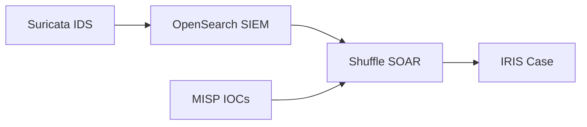
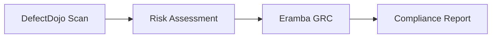

# 🛡️ OSSOP - Open Source Security Operations Platform

**A comprehensive, enterprise-ready security stack that provides SIEM, SOAR, threat intelligence, vulnerability management, and compliance capabilities in a single Docker deployment.**

---

## 🚀 **Quick Start**

Get your complete security operations center running in under 5 minutes:

```bash
# 1. Clone the repository
git clone https://github.com/openmoto/ossop.git
cd ossop

# 2. Start the security stack
docker compose up -d

# 3. Access your platforms
# SIEM Dashboard: http://localhost:5601 (admin/StrongPassword123!)
# Service Monitor: http://localhost:3001 (create account)
```

**That's it!** Your security operations center is now running with 21 integrated services.

---

## 🎯 **What You Get**

### **Core Security Capabilities**
- **🔍 SIEM** - Centralized logging, threat detection, and security analytics
- **🤖 SOAR** - Automated incident response and security orchestration  
- **📋 Case Management** - Digital forensics and incident response workflows
- **🕷️ Threat Intelligence** - IOC sharing and threat hunting capabilities
- **🛡️ Vulnerability Management** - Application security testing and tracking
- **📊 Compliance & GRC** - Governance, risk, and compliance management
- **👁️ Network Monitoring** - IDS/IPS and network security monitoring
- **🔎 OSINT** - Open source intelligence gathering and reconnaissance
- **📈 Service Monitoring** - Complete platform health and alerting

### **Enterprise Features**
- **Single Sign-On Ready** - LDAP/OIDC integration capabilities
- **Scalable Architecture** - Microservices design with dedicated databases
- **High Availability** - Container orchestration with health checks
- **Data Persistence** - Named volumes for reliable data storage
- **Security Hardened** - Isolated networks and least-privilege access

---

## 🏗️ **Platform Overview**

| Platform | Purpose | Access | Key Features |
|----------|---------|---------|--------------|
| **OpenSearch + Dashboards** | SIEM Core | :5601 | Log analysis, dashboards, alerting |
| **Shuffle** | SOAR Platform | :80 | Workflow automation, playbooks |
| **IRIS** | Case Management | :8080 | Incident response, digital forensics |
| **MISP** | Threat Intelligence | :8082 | IOC sharing, threat feeds |
| **DefectDojo** | Vulnerability Mgmt | :8083 | AppSec testing, vulnerability tracking |
| **Eramba** | GRC Platform | :8081 | Risk management, compliance |
| **SpiderFoot** | OSINT Platform | :5002 | Reconnaissance, intelligence gathering |
| **Wazuh** | Endpoint Security | :55000 | EDR, host-based monitoring |
| **Suricata** | Network IDS | - | Network threat detection |
| **Uptime Kuma** | Service Monitor | :3001 | Platform health, alerting |

---

## 🔧 **Initial Setup & Configuration**

### **1. SIEM (OpenSearch Dashboards)**
```
URL: http://localhost:5601
Login: admin / StrongPassword123!
```

**First Steps:**
1. Create index patterns: `filebeat-*`, `wazuh-alerts-*`, `suricata-*`
2. Import pre-built dashboards for security monitoring
3. Configure alerting rules for critical events
4. Set up data retention policies

### **2. SOAR (Shuffle)**
```
URL: http://localhost:80
Setup: First-time wizard
```

**First Steps:**
1. Complete initial setup wizard
2. Import security playbooks from Shuffle community
3. Configure integrations with SIEM and case management
4. Create automated response workflows

### **3. Case Management (IRIS)**
```
URL: http://localhost:8080
Login: administrator / [check logs: docker logs iris-web | grep "login with"]
```

**First Steps:**
1. Set up case templates for incident types
2. Configure user roles and permissions
3. Integrate with threat intelligence feeds
4. Create evidence collection workflows

### **4. Service Monitoring (Uptime Kuma)**
```
URL: http://localhost:3001
Setup: Create admin account
```

**First Steps:**
1. Add monitors for all security services ([Quick Setup Guide](MONITORING_SETUP.md))
2. Configure alerting (Slack, email, Teams)
3. Create status pages for stakeholders
4. Set up maintenance windows

---

## 🔗 **Platform Integration Scenarios**

### **Scenario 1: Threat Detection → Response**


**Logical Flow:**
- **Suricata** detects anomaly → sends to **OpenSearch**
- **OpenSearch** processes/correlates → triggers **Shuffle**  
- **Shuffle** gets threat intelligence ← from **MISP**
- **Shuffle** (enriched with MISP data) → creates **IRIS** case

### **Scenario 2: Vulnerability → Risk Management**


**Flow:**
1. **DefectDojo** discovers application vulnerabilities
2. Risk assessment performed with CVSS scoring
3. **Eramba** tracks remediation and compliance impact
4. Automated compliance reporting generated

### **Scenario 3: OSINT → Threat Hunting**


**Flow:**
1. **SpiderFoot** gathers intelligence on threat actors
2. **MISP** stores and shares IOCs with team
3. **OpenSearch** hunts for IOCs in historical data
4. **IRIS** manages investigation workflow

---

## 📅 **A Day in the Life: SOC Analyst**

### **Morning: Threat Landscape Review**
**8:00 AM - Platform Health Check**
- Check **Uptime Kuma** dashboard for service status
- Review **OpenSearch** dashboards for overnight alerts
- Validate **Wazuh** agent connectivity and health

**8:15 AM - Threat Intelligence Update**
- Review **MISP** for new IOCs and threat feeds
- Update **SpiderFoot** scans for monitored infrastructure
- Check **Shuffle** automation results from overnight

### **Midday: Incident Response**
**12:00 PM - Security Alert Investigation**
- **OpenSearch** alert: Suspicious PowerShell execution
- **IRIS** case created automatically via **Shuffle** playbook
- **MISP** consulted for IOC enrichment and attribution
- **DefectDojo** checked for related vulnerability context

**12:30 PM - Evidence Collection**
- **Wazuh** provides endpoint forensic data
- **Suricata** shows network traffic patterns  
- **IRIS** documents timeline and evidence chain
- **Shuffle** coordinates containment actions

### **Evening: Reporting & Improvement**
**5:00 PM - Daily Reporting**
- **Eramba** generates compliance metrics
- **OpenSearch** provides security KPIs and trends
- **Uptime Kuma** shows platform availability stats
- **IRIS** summarizes case status and metrics

**5:30 PM - Process Improvement**
- **Shuffle** playbook tuning based on day's incidents
- **MISP** IOC quality review and threat feed updates
- **DefectDojo** vulnerability remediation tracking

---

## 📅 **A Day in the Life: Security Manager**

### **Strategic Overview**
**9:00 AM - Executive Dashboard**
- **Eramba** risk posture and compliance status
- **OpenSearch** security metrics and trend analysis
- **Uptime Kuma** platform reliability and SLA metrics
- **IRIS** incident response performance indicators

### **Risk Management**
**10:00 AM - Vulnerability Review**
- **DefectDojo** vulnerability trends and remediation rates
- **Eramba** risk register updates and treatment plans
- Cross-platform risk correlation and prioritization

### **Threat Intelligence**
**2:00 PM - Intelligence Analysis**
- **MISP** threat landscape and attribution analysis
- **SpiderFoot** attack surface monitoring results
- **OpenSearch** threat hunting campaign results
- Intelligence sharing with industry partners

---

## ⚙️ **Advanced Configuration**

### **High Availability Setup**
- Load balancer configuration for web interfaces
- Database clustering and replication
- Backup and disaster recovery procedures

### **Enterprise Integration**
- LDAP/Active Directory authentication
- SIEM integration with existing security tools
- API integrations and custom connectors

### **Scaling Considerations**
- Resource allocation per service
- Performance tuning and optimization
- Multi-node deployment strategies

---

## 📊 **Current Service Status**

All services are fully operational with the following status:

| Service | Status | Access | Notes |
|---------|--------|---------|-------|
| **OpenSearch** | ✅ Healthy | :9200 | SIEM core engine |
| **OpenSearch Dashboards** | ✅ Healthy | :5601 | Web UI accessible |
| **Wazuh Manager** | ✅ Healthy | :55000 | EDR platform ready |
| **Shuffle Frontend** | ✅ Working | :80 | SOAR automation |
| **Shuffle Backend** | ✅ Working | :5001 | API ready (needs admin setup) |
| **Shuffle Database** | ✅ Healthy | Internal | PostgreSQL initialized |
| **IRIS** | ✅ Healthy | :8080 | Case management |
| **MISP** | ✅ Working | :8082 | Threat intelligence |
| **DefectDojo** | ✅ Healthy | :8083 | Vulnerability management (full UI) |
| **DefectDojo nginx** | ✅ Running | Internal | Static files served |
| **Eramba** | ✅ Healthy | :8081 | GRC platform |
| **SpiderFoot** | ✅ Healthy | :5002 | OSINT platform |
| **Suricata** | ✅ Running | Internal | Network IDS active |
| **Filebeat** | ✅ Starting | Internal | Log shipping (auth config needed) |
| **Uptime Kuma** | ✅ Working | :3001 | Service monitoring |

**Recent Fixes & Improvements:**
- ✅ **DefectDojo**: Added nginx container for proper static file serving - UI now fully styled
- ✅ **Shuffle Database**: Fixed PostgreSQL environment variables and initialization  
- ✅ **Filebeat**: Resolved permission issues with `-strict.perms=false` flag
- ✅ **Port Configuration**: All ports now configurable via environment variables
- ✅ **Auto-Initialization**: DefectDojo automatically runs migrations and creates admin user

---

## 🔧 **Environment Variables**

Key configuration options in your `.env` file:

```bash
# Core Settings
HOSTNAME=localhost
OPENSEARCH_INITIAL_ADMIN_PASSWORD=StrongPassword123!

# Service Ports (customize as needed)
OPENSEARCH_DASHBOARDS_PORT=5601
SHUFFLE_FRONTEND_PORT=80
IRIS_PORT=8080
MISP_PORT=8082
DEFECTDOJO_PORT=8083
ERAMBA_PORT=8081
SPIDERFOOT_PORT=5002
UPTIME_KUMA_PORT=3001

# DefectDojo Configuration
DEFECTDOJO_ADMIN_USER=admin
DEFECTDOJO_ADMIN_PASSWORD=admin  
DD_INITIALIZE=true  # Set to false after first startup

# Shuffle Database (auto-configured)
SHUFFLE_DB_USER=shuffle
SHUFFLE_DB_PASSWORD=ShuffleDbPassword123!
SHUFFLE_DB_NAME=shuffle

# All other database settings are pre-configured for immediate use
```

---

## 📊 **System Requirements**

### **Minimum Requirements**
- **CPU:** 8 cores
- **RAM:** 16 GB  
- **Storage:** 100 GB SSD
- **Network:** 1 Gbps

### **Recommended Production**
- **CPU:** 16+ cores
- **RAM:** 32+ GB
- **Storage:** 500+ GB NVMe SSD
- **Network:** 10 Gbps

### **Supported Platforms**
- **Docker:** 20.10+
- **Docker Compose:** 2.0+
- **OS:** Linux, Windows (WSL2), macOS

---

## 📚 **Additional Documentation**

- **[TROUBLESHOOTING.md](TROUBLESHOOTING.md)** - Technical troubleshooting guide for common issues
- **[MONITORING_SETUP.md](MONITORING_SETUP.md)** - Uptime Kuma monitoring configuration guide

## 🆘 **Support & Community**

- **Documentation:** [Wiki](link-to-wiki)
- **Issues:** [GitHub Issues](link-to-issues)
- **Discussions:** [Community Forum](link-to-discussions)
- **Security:** [Security Policy](SECURITY.md)

---

## 📄 **License**

This project is licensed under the MIT License - see the [LICENSE](LICENSE) file for details.

---

## 🙏 **Acknowledgments**

Built with these amazing open-source projects:
- OpenSearch, Wazuh, Shuffle, DFIR-IRIS, MISP, DefectDojo, Eramba, SpiderFoot, Suricata, Uptime Kuma

**Ready to secure your organization? Start with `docker compose up -d`** 🚀
